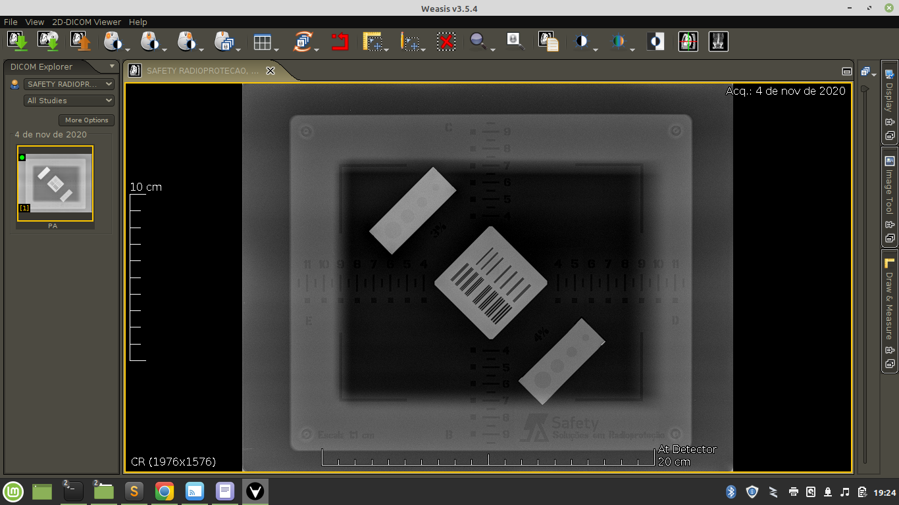
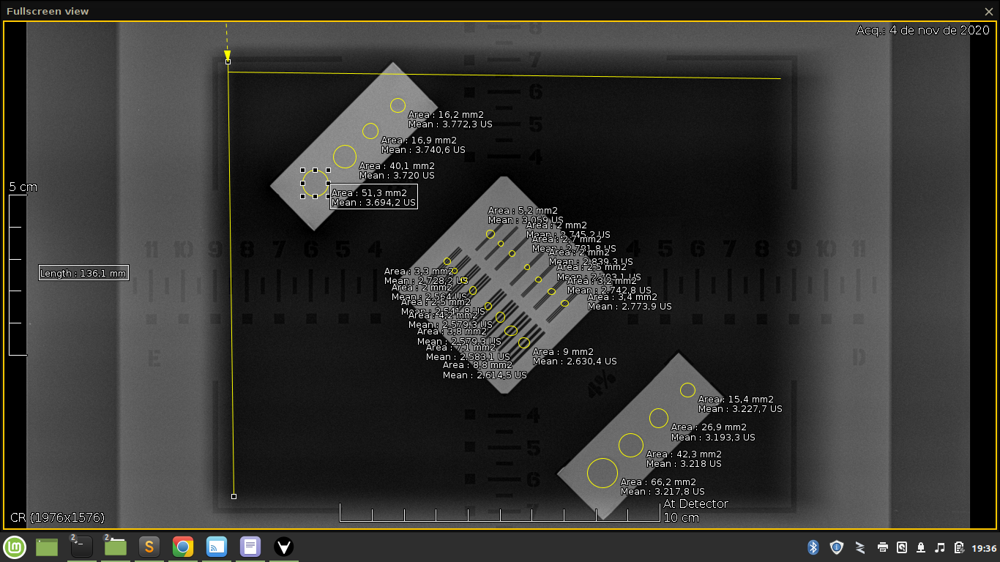
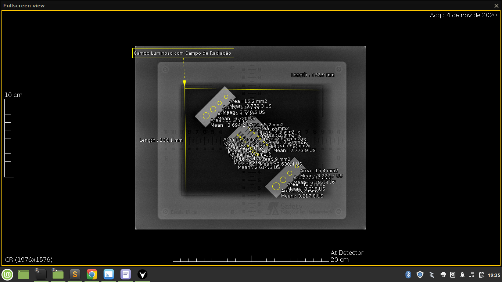

## Gerando DICOM PR (PR, Presentation State)

O sofware de visualização mostra a imagem do fantoma:


São feitas as medições (no caso o python realizará essas medições de forma automática):



O resultado das medições é exibido:



## Criando DICOM PR

O arquivo **dicom_CR** é o arquivo da imagem do fantoma, já o arquivo  **dicom_PR** são as anotações. Considerando o **dicom_PR** nominal o qual foi criado usando o seguinte tutorial(https://nroduit.github.io/en/tutorials/build-ko-pr/), vamos converte-lo para XML. O XML é o template que iremos utilizar neste exemplo, mas o sistema não necessáriamente precisa usar o XML para a criação do dicom, pode simplesmente montar o objeto no pydicom e exportar o arquivo.

# Criando o XML a partir do dicom

```bash

dcm2xml  dicom_PR dicom_PR.xml

```

# Criando dicom a partir do XML
```bash

xml2dcm  dicom_PR.xml dicom_PR_gerado.dcm

```

# Tags DICOM

As informações sobre as tags podem ser encontras no seguinte indereço:https://dicom.innolitics.com/ciods


# Implementação
Você pode usar um XML como template, fazer as medições e jogar nesse XML e usar o comando xml2dcm, ou ainda pode gerar o dicom diretamente usando o pydicom https://pydicom.github.io/pydicom/stable/auto_examples/input_output/plot_write_dicom.html ou SIMPLEITK https://github.com/zivy/SimpleITK/blob/8e94451e4c0e90bcc6a1ffdd7bc3d56c81f58d80/Examples/DicomSeriesReadModifyWrite/DicomSeriesReadModifySeriesWrite.py


